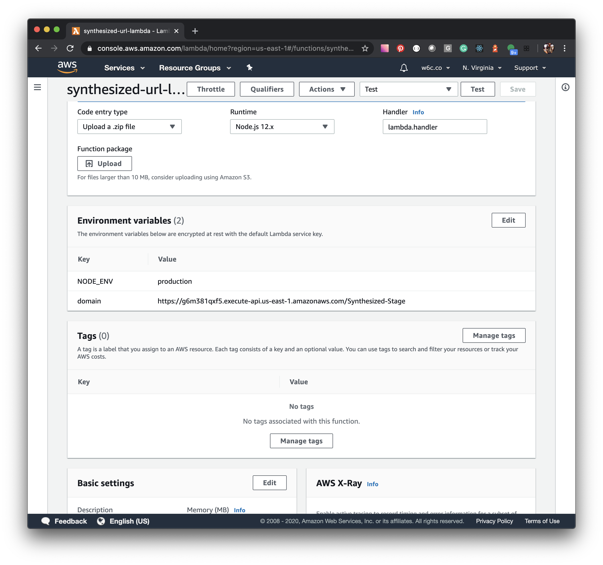
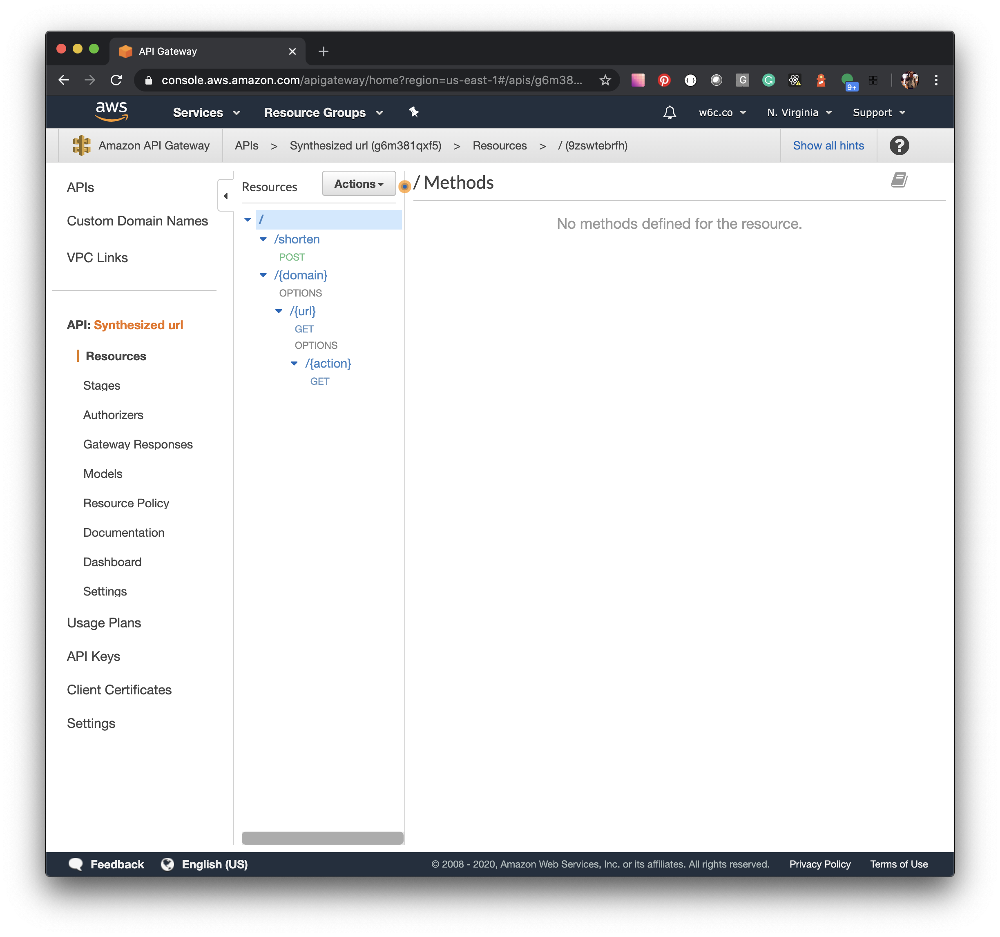

# Synthesized URL
This test shorts a given URL. It provides a command-line interface to interact with the API. The project does not include an external database to avoid dependencies and allowing to port quickly to AWS. See production deployment. 

## How to run the project
The solution includes all different projects on a single repository.

### Server
The server application uses NodeJS. As any other Node project, install dependencies first `npm install`. The available script are the following:
1. `npm run dev` Runs the server to expose the API.
2. `npm run test` Executes the available tests.
3. `npm run fix` It just executes standard js to keep the code uniform.

#### Available endpoints
The following endpoints are exposed:

##### Short URL
Short the given URL. This is a post a request. It takes the following process:
1. The method breaks the given URL into parts domain and  URL. The objective is to increase the number of URLs that the system can store.
2. The shorten method creates a file to identify domains, URLs, also for status and stats.
3. If the URL has created already, it returns the path.

```shell
curl --location --request POST 'http://localhost:3000/shorten/' \
--header 'Content-Type: application/json' \
--data-raw '{
    "url": "https://github.com/bipsa/synthesized_url"
}'
```
###### Response
```js
{
  "url": "http://localhost:3000/oOJ/q7x/"
}
```

##### View URL
This endpoint redirects the user to the hidden URL
```shell
curl --location --request GET 'http://localhost:3000/oOJ/q7x/'
```
###### Response if the URL has been disabled
The http code sent is 400
```js
{
  "message": "URL is not available."
}
```

##### Disable URL
This endpoint disable an url
```shell
curl --location --request GET 'http://localhost:3000/oOJ/q7x/disable/'
```
###### Response
```js
{
  "response": false
}
```

##### Enable URL
This endpoint enable an url
```shell
curl --location --request GET 'http://localhost:3000/oOJ/q7x/enable/'
```
###### Response
```js
{
  "response": true
}
```

##### Stats URL
This endpoint shows the stats for the given url
```shell
curl --location --request GET 'http://localhost:3000/oOJ/q7x/stats/'
```
###### Response
The http code sent is 400
```js
{
  "total": 2,
  "visits": [
    {
      "ip": "::1",
      "date": "2020-05-17T03:23:22.319Z"
    },
    {
      "ip": "::1",
      "date": "2020-05-17T03:23:53.926Z"
    }
  ]
}
```

### CLI
The CLI application uses NodeJS. Also, install dependencies first `npm install`. The available commands are the following:
1. `node index shorten https://facebook.com` Shrinks the given URL.
2. `node index stats http://localhost:3000/rp7/Sxz/` Returns the stats from the given URL.
3. `node index disable http://localhost:3000/rp7/Sxz/` Disables the URL.
4. `node index enable http://localhost:3000/rp7/Sxz/` Enable the URL.

## Run the project on AWS
The method used in development gives the flexibility to port the project to AWS with not much effort, but additional configuration is required.
`lambda.js` contains the code to run the project on AWS using Lambda, APIGateway, and S3. Of course, the stack could be evaluated on production by using a faster data method, but S3 gives Multiple regions, and different cache methods out of the box.

This is the request for shorten on AWS

```shell
curl --location --request POST 'https://g6m381qxf5.execute-api.us-east-1.amazonaws.com/Synthesized-Stage/shorten/' \
--header 'Content-Type: application/json' \
--data-raw '{
    "url": "https://www.skillshare.com/classes/Understanding-Web-Development-A-Beginners-Guide-to-the-Web/1755504373?via=logged-in-home-row-recommended"
}'
```

This is the view request - Note: Some configuration is missing on the API Gateway to allow redirection :(
```shell
curl --location --request GET 'https://g6m381qxf5.execute-api.us-east-1.amazonaws.com/Synthesized-Stage/hlF/87C/'
```

The request to get the actions, by changing 'stats' for 'enable' or 'disable' you get those actions
```shell
curl --location --request GET 'https://g6m381qxf5.execute-api.us-east-1.amazonaws.com/Synthesized-Stage/hlF/87C/stats'
```

### What do you need to configure on AWS?

#### Upload the lambda
1. You can give any name to the lambda function
2. Add two env variables NODE_ENV, and domain (the domain is used to generate the URL, the example uses the default DNS provided by API gateway)
3. Add permission for S3 to the lambda role (read and write)



#### Create the API
1. Create the api with any name you want, of course following the best practices
2. Create shorten resource
3. Create a post method and attached the lambda
4. Create {domain} {url} {action} resources
5. Add get method to url and action
6. Enable sending the user headers in order to get IP address and actions



#### Create Bucket
1. Create the bucket and name it `synthesized-url`
2. You don't need public access

### TODO's
1. Increase test coverage
2. Standardize the AWS calls with the file system to reduce code.
3. Script to upload everything to AWS
4. Redirection issue on API Gateway